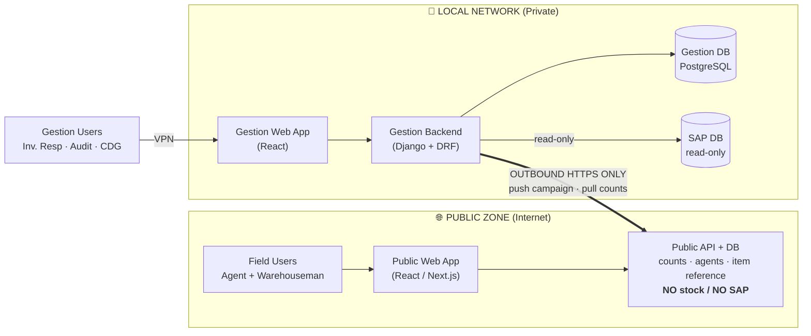
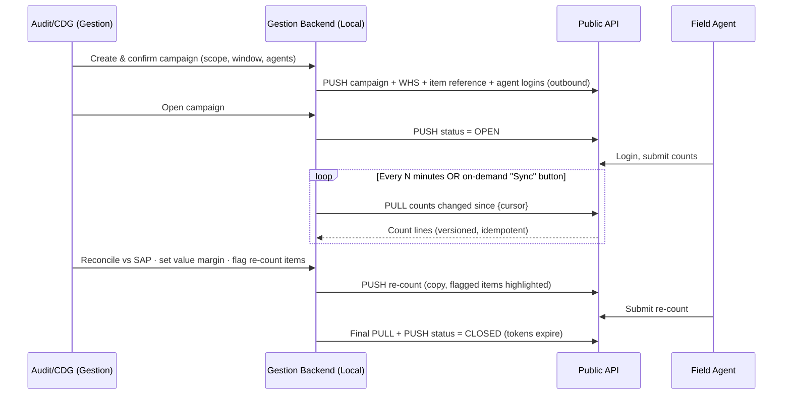
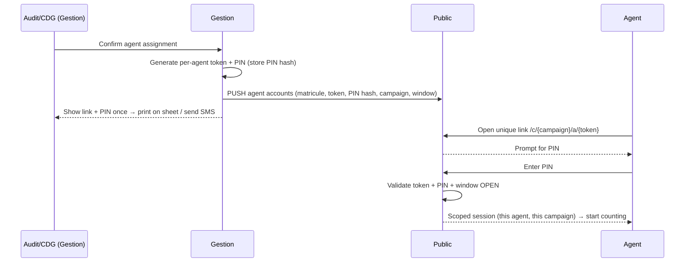

# Inventory Platform — Architecture & System Design

> **Companion to** `inventory_process.md` (the business process).
> This document describes the **technical architecture** of the two-platform inventory system, how they connect, how login works on the public side, and the pages each platform needs.

---

## 1. Goals & Constraints

| # | Constraint | Implication |
|---|------------|-------------|
| C1 | SAP DB is reachable only from the **local company network** | All SAP access stays on the local server; nothing public touches SAP. |
| C2 | The management platform must **not be public** | Gestion app sits behind **VPN** on the local network. |
| C3 | Field users (Agents, Warehousemen) **need internet access** | A separate **public** app, hosted externally (Vercel / Cloudflare). |
| C4 | The public app must have **no visibility of stock** | Public DB stores **counts + item reference only** — never system quantities, costs, or gaps. |
| C5 | Both apps must **feel like one product** | Shared design system (brand, components, naming). No user ever sees both, so this is a UX/branding concern, not a routing one. |
| C6 | The **local server must stay isolated** | The local server **only makes outbound calls**; it never exposes an inbound port to the internet. |
| C7 | The public app is **closed by default** | It only "opens" during a campaign window (1–2 days), controlled by Audit/CDG. |

---

## 2. High-Level Architecture

Two platforms, two trust zones, one direction of connection.



**The golden rule:** the **arrow only goes one way** at the connection layer — the **local (gestion) backend initiates everything**. The public platform never calls into the local network, and the local network exposes **no inbound port** to the internet. This is what keeps SAP safe.

---

## 3. How Platform 1 (Gestion) Gets Data From Platform 2 (Public)

> *This is your first key question.*

### 3.1 Direction of connection — Pull, not Push

There are two ways to move the field counts from public → gestion:

| Pattern | How it works | Verdict |
|---------|--------------|---------|
| **Push** (public → local webhook) | Public calls a local endpoint when a count is saved | ❌ Requires opening an **inbound** port on the local network → breaks isolation. **Reject.** |
| **Pull** (local → public API) | Local backend periodically **fetches** new counts from the public API | ✅ Local stays **outbound-only**. SAP zone never exposed. **Use this.** |

So: the **gestion backend polls the public API** (and also pushes campaign data outward). Both directions of *data* are carried over connections that are **always initiated by the local server**.

### 3.2 The two flows over that single outbound channel



**Push (outbound):** campaign window, WHS list, **item reference** (code, name, color/parfum, unit↔pack conversion — *never quantities*), agent logins, status changes, re-count instructions.

**Pull (outbound):** submitted count lines and their progress.

### 3.3 Making the pull reliable (idempotency)

Each count line on the public side carries:
- a **stable `line_id`** (UUID),
- a **`version`** integer (incremented on each edit / re-count),
- an **`updated_at`** timestamp.

The gestion backend keeps a **sync cursor** (last `updated_at` or a sequence number) per campaign and asks:
`GET /api/sync/counts?campaign={id}&since={cursor}`.
It then **upserts** by `line_id` + `version`. This makes re-polling safe (no duplicates) and lets you re-run a sync after a failure without corruption.

### 3.4 Who runs the polling

A scheduled job on the local server: **Celery beat** (if you already use Celery) or a simple **Django management command on cron**, e.g. every 2–5 minutes while a campaign is `OPEN`, plus a manual **"Sync now"** button in the gestion UI for CDG.

---

## 4. Authentication Between the Two Platforms (Machine-to-Machine)

The local server authenticates to the public API as a *service*, not a user.

- **Credential:** a long, random **service token** (or short-lived **JWT** signed with a shared secret), stored only in the **local server's environment secrets** — never in the public app, never in git.
- **Transport:** HTTPS only. Optionally **mutual TLS** for an extra layer.
- **Scope:** the token grants only the sync endpoints (`/api/sync/*`), nothing else.
- **Rotation:** rotate on a schedule and immediately if leaked. Support two valid keys during rotation.
- **Hardening:** rate-limit the sync endpoints, allow-list the company's egress IP if it's static, and sign each request body with an **HMAC** so the public side can verify it wasn't tampered with.

Because the public app is the *passive* side here, even if its host is compromised, an attacker gets **counts + item codes** — no stock, no SAP, no inbound path to the local network.

---

## 5. Public-Platform User Login

> *This is your second key question.* Constraints: not all agents have email · KPI must be tracked per agent · the app is open only during the campaign window.

### 5.1 Option comparison

| Option | KPI tracking | Security | UX for non-technical staff | Verdict |
|--------|:------------:|:--------:|:--------------------------:|---------|
| Anonymous public link `/long-code` (shared) | ❌ none | ❌ anyone with link submits | ✅ easy | ❌ Reject (no accountability) |
| Microsoft SSO | ✅ | ✅ | ❌ agents have no accounts/email | ❌ Not viable for field users |
| **Per-agent login** (recommended) | ✅ per agent | ✅ scoped + expiring | ✅ easy | ✅ **Use this** |

### 5.2 Recommended: per-agent passwordless login (identity link + PIN)

When **Audit confirms the assignment list** (Phase 0 of the process), the gestion backend **generates one login per field user** and pushes it to the public side:

- **Identity:** the agent's **matricule / employee ID** (or a generated short code if they have none). This is what attributes counts → enables KPI.
- **Secret:** a **PIN** (4–6 digits) generated by gestion. Only the **hash** is pushed to public; the plaintext is shown once to gestion to hand out.
- **Delivery:** a **unique magic link** that carries the identity (`/c/{campaign}/a/{agent-token}`), handed to the agent **on their printed dispatch sheet** or by **SMS/WhatsApp**. The link pre-fills *who they are*; the **PIN** is the secret they enter. Link (something you have) + PIN (something you know) ≈ two factors.



### 5.3 Why this is safe and practical

- **Attribution / KPI:** every count line is stamped with the agent identity → you can measure speed, accuracy, re-count rate per agent.
- **Time-boxed:** the login is bound to the campaign window. When CDG closes the campaign, tokens **expire** and the app shows "no active campaign."
- **Revocable:** CDG can revoke or regenerate a single agent's link/PIN without touching others.
- **Leak-resistant:** a leaked link alone is useless without the PIN; rate-limit PIN attempts and lock after N tries.
- **Optional device binding:** first device to use the link "claims" it for the session, blocking link-sharing.

> **Alternative if agents reliably have a phone number:** **matricule + SMS one-time code (OTP)** per session. Same attribution, no PIN to remember, but depends on SMS delivery.

---

## 6. Campaign Open/Close Lifecycle

The public app has **no permanent open state**. Its availability is driven entirely by what gestion pushes.

```
DRAFT → (Audit/CDG confirm) → ARMED → (open) → OPEN ⇄ RECOUNT → (close) → CLOSED → ARCHIVED
```

- **ARMED:** campaign + agents pushed to public, but the window hasn't started → public shows a waiting/closed screen.
- **OPEN:** within `[open_at, close_at]`; agents can log in and count.
- **RECOUNT:** CDG flags items; a re-count copy is pushed; flagged items reopen for those agents.
- **CLOSED:** window passed or closed manually → public read-only/locked, tokens expire.

Audit/CDG control `open_at`, `close_at`, manual open/close, and extend — all from the gestion UI, propagated to public via the outbound push.

---

## 7. Data Split — What Lives Where

| Data | Gestion (Local) | Public |
|------|:---------------:|:------:|
| SAP **system stock / quantities** | ✅ | ❌ never |
| **Values, costs, margins, gaps** | ✅ | ❌ never |
| Reconciliation & re-count decisions | ✅ | ❌ |
| Campaign window + status | ✅ (source) | ✅ (copy) |
| WHS list | ✅ | ✅ (needed to count) |
| **Item reference** (code, name, variant, unit↔pack) | ✅ | ✅ (no quantities) |
| Agent logins (token + PIN hash) | ✅ (source) | ✅ |
| **Submitted count lines** | ✅ (pulled copy) | ✅ (origin) |
| Sign-off (signed paper record) | ✅ | ❌ |
| History / archive / dashboard | ✅ | ❌ |

> **Data-sensitivity knob:** decide whether the item reference pushed to public is the **full catalog** or **only items expected per WHS**. Per-WHS is tighter (less leakage of what's stocked where) but a bit more to manage. Either way, **no quantities ever leave the local zone**.

---

## 8. Tech Stack

### 8.1 Gestion (fixed — your existing structure)
- **Django + DRF** backend, **React** frontend (reusing your component library).
- **PostgreSQL**.
- **SAP read-only** connection (DB read or SAP API) — local only.
- **Celery beat** or cron management command for the sync job.
- Auth: **Django auth + groups** now (Inventory Resp / Audit / CDG), **Microsoft SSO (OIDC/SAML)** later.
- **Runs entirely in Docker (dev and prod).** The whole gestion stack — Django **web**, **PostgreSQL**, **Redis**, **Celery worker**, **Celery beat**, and the **React frontend** — is defined in `gestion/docker-compose.yml` and started with `docker compose up`. The host only needs **Docker + Docker Compose**; nothing (Python, Postgres, Redis) is installed directly on the machine. This keeps the local environment reproducible and the gestion services neatly isolated on the private network.
- Hosted on the **local server**, behind **VPN**; container ports bound to the **private interface only** (never exposed to the internet — see §11).

### 8.2 Public (your choice — recommendation below)

| Option | Backend | Hosting | Best when |
|--------|---------|---------|-----------|
| **A — Next.js (recommended for Vercel/Cloudflare)** | Next.js API routes + serverless **Postgres** (Neon / Supabase) | Vercel or Cloudflare | You want simple managed hosting and serverless scale; React everywhere. |
| **B — Django + DRF + React** | Django/DRF (reuse your patterns) | Render / Railway / Fly.io behind Cloudflare | You want maximum backend code reuse with the gestion stack. |

> Vercel/Cloudflare are a natural fit for **Next.js**, not Django, so if hosting there is the priority, Option A is the smoother path. Either way, put **Cloudflare** in front for **WAF + rate limiting + bot protection**, and store **no stock data**.

---

## 9. Making Them Feel Like One Product

Since no single user sees both apps, "one product" = **consistent identity**, achieved by sharing UI, not infrastructure:

- Extract a **shared UI package** (design tokens: colors, fonts, spacing; logo; core components) consumed by both the gestion React app and the public app.
- Same **name, favicon, login look, terminology** on both.
- Optionally serve the public app under a **subdomain of the company brand** (e.g. `count.company.com`) via Cloudflare, so the URL also feels native — while the gestion app stays at an internal address behind VPN.

---

## 10. Pages per Platform & Role

### 10.1 Gestion Platform (internal / VPN)

| Page | Inv. Resp | Audit | CDG |
|------|:---------:|:-----:|:---:|
| Login (Django now → MS SSO later) | ✅ | ✅ | ✅ |
| Home / campaigns overview (statuses, progress) | ✅ | ✅ | ✅ |
| **Create campaign** (scope all/specific WHS, type monthly/period, trigger, window) | view | ✅ | ✅ |
| **Agent assignment** per WHS | ✅ | view | view |
| **Confirm assignment list** | — | ✅ | — |
| **Open / close / extend campaign** | — | ✅ | ✅ |
| WHS / depot management | ✅ | ✅ | ✅ |
| Item-reference sync preview (what gets pushed) | ✅ | ✅ | ✅ |
| **Live counts monitoring** (per WHS / per agent, pulled) | ✅ | ✅ | ✅ |
| **Reconciliation workspace** (physical vs SAP, **set value margin per WHS**, flag re-counts) | — | view | ✅ |
| **Re-count management** (create copy, push flagged items) | — | view | ✅ |
| **CSV export** (for SAP import) | — | — | ✅ |
| **Sign-off tracking** (attach scanned signed sheet, mark received) | ✅ | ✅ | ✅ |
| **Agent KPI** (speed, accuracy, re-count rate) | ✅ | ✅ | ✅ |
| **History / archive** (past campaigns + gaps) | ✅ | ✅ | ✅ |
| Analysis dashboard (TBD) | ✅ | ✅ | ✅ |
| Admin: users & groups | Django admin (for now) | | |

### 10.2 Public Platform (field — Agent / Warehouseman)

| Page | Purpose |
|------|---------|
| Landing / "no active campaign" | Default closed state when no window is open |
| Login (magic link + PIN) | Per-agent authentication, scoped to campaign |
| My campaign / WHS | Shows the agent's assignment + instructions |
| **Count entry** | Item list (code, name, color/parfum), enter qty **by unit / by pack**, add item not in list, save/submit |
| **Re-count** | Same as count but **only flagged items highlighted** |
| Progress / submission status | What's done, what's pending, confirmation |
| Profile | Who am I, my progress (no stock, no values) |

---

## 11. Security Summary

1. **Outbound-only** from local → public; **no inbound** to the local network. SAP unreachable from the internet.
2. **Data minimization**: public never receives quantities, values, gaps, or SAP data.
3. **M2M auth**: scoped service token / JWT + HMAC-signed bodies, rotated, optional mTLS and egress-IP allow-list.
4. **Field auth**: per-agent identity link + PIN, time-boxed to the campaign, revocable, rate-limited.
5. **Edge protection**: Cloudflare WAF + rate limiting in front of the public app.
6. **Audit trail** on both sides (who did what, when).
7. **VPN** for all gestion access.

---

## 12. Open Items for the Build Phase

1. **SAP read method** — direct DB read vs SAP API; live read vs snapshot at campaign start.
2. **CSV export format** required by the SAP import (columns, encoding, field mapping).
3. **Item reference scope** — full catalog vs per-WHS expected list (see §7 knob).
4. **Public stack decision** — Option A (Next.js/Vercel) vs Option B (Django/Render).
5. **Field login variant** — link + PIN vs matricule + SMS OTP (depends on whether agents have reliable phone numbers).
6. **Signed-sheet capture** — scan upload vs email ingestion into the gestion record.
7. **Dashboard KPIs** — to define with the analysis requirements.

---

*Next step: pick the public stack and the field-login variant, then we can scaffold the data models and the sync API contract for both sides.*
