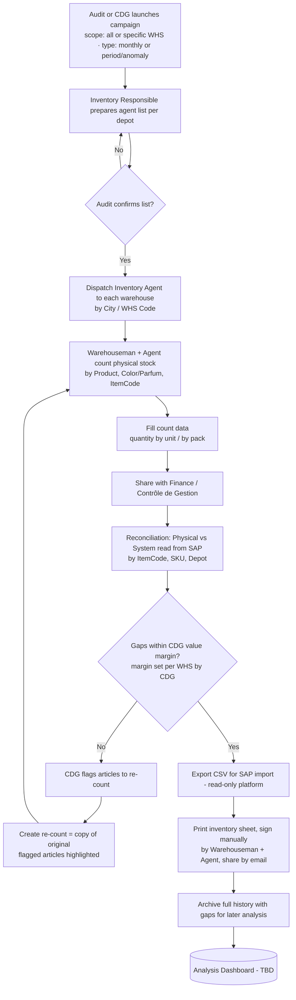

# Inventory Control Process — Business Documentation

> **Purpose of this document**
> This file describes the **current (as-is) inventory process**, the **roles and responsibilities** involved, the **data handled**, and the **business rules**.
> It is the functional foundation for designing the future platform (the *to-be* system) connected to SAP. Architecture and dashboard details will be added in a later document.

---

## 1. Overview

Each month, every depot/warehouse must undergo an **inventory check** to compare the **physical stock** against the **system (SAP) stock**. The goal is to detect, validate, and post stock differences (*écarts / gaps*) in a controlled, auditable, and error-free way.

Today the process relies heavily on **Excel files**, **paper sign-off**, and **email**, which introduces risk (manual errors, version conflicts, slow turnaround, weak traceability). The target is to **consolidate the whole flow in one platform** connected to the SAP database.

**Key dimensions used throughout the process:**

| Dimension | Description |
|-----------|-------------|
| Depot / Warehouse | Physical location, identified by **City** and/or **WHS Code** |
| ItemCode | SAP item identifier |
| SKU | Stock Keeping Unit (variant level) |
| Variant attributes | **Color / Parfum** and other product characteristics |
| Counting unit | **By unit** or **by pack** |

---

## 2. Actors & Responsibilities

| # | Role (EN / FR) | Main Responsibility |
|---|----------------|---------------------|
| 1 | **Inventory Responsible** / *Inventoriste Responsable* | Owns the inventory campaign; prepares the list of inventory agents assigned per depot; plans the schedule. |
| 2 | **Audit** | Independently reviews and **confirms/approves** the agent-to-depot assignment before counting starts (control & segregation of duties). |
| 3 | **Inventory Agent** / *Agent d'inventaire* | Dispatched to each warehouse; performs the physical count with the warehouseman; records the counts. |
| 4 | **Warehouseman** / *Magasinier* | Co-performs the count; provides knowledge of physical layout/stock; **co-signs** the inventory sheet. |
| 5 | **Finance / Management Control** / *Contrôle de Gestion* | Receives the counts; performs the reconciliation (*rapprochement*) physical vs system; validates against tolerance; triggers re-count or posting. |
| 6 | **SAP / System** | Source of theoretical (system) stock; destination of posted adjustments (via CSV import). |

> A RACI matrix per process step is provided in **Section 6**.

---

## 3. Process Flow (As-Is)

---

## 4. Detailed Steps

### Phase 0 — Campaign Launch, Planning & Authorization
- A **campaign is launched by Audit or by the CDG group**.
- **Scope:** a campaign can target **all warehouses at once** or **one (or specific) warehouse(s)**.
- **Type / trigger:**
  - **Monthly** (recurring routine inventory), or
  - **Period / ad-hoc** — launched when **high gaps or an anomaly** are detected.
- The **Inventory Responsible** prepares the list of **Inventory Agents assigned by depot**.
- **Audit** reviews and **must confirm** the list before any counting can begin.
- *Output:* a launched campaign (scope + type) with an approved assignment plan (agent ↔ depot ↔ date).

### Phase 1 — Dispatch & Physical Count
- Each **Inventory Agent** is sent to a **warehouse**, separated by **City** or **WHS Code**.
- The **Warehouseman and Inventory Agent together** count the products in stock.
- Counting granularity: **by product, by color/parfum, by ItemCode**.
- *Output:* raw physical counts.

### Phase 2 — Data Capture
- The counted quantities are entered into an **Excel file**.
- Quantities are recorded **by unit** or **by pack**.
- *Output:* completed count file per depot.

### Phase 3 — Sharing
- The Excel file is **shared with the Finance / Contrôle de Gestion team**.

### Phase 4 — Reconciliation (*Rapprochement*)
- Finance compares **physical vs system stock**.
- Comparison keys: **ItemCode, SKU, Depot**.
- Gaps/écarts are computed per line.

### Phase 5 — Decision (Tolerance Gate)
- The tolerance margin is defined **by value** (monetary), **not** by quantity or percentage.
- **CDG can adjust the margin freely during the rapprochement of each WHS inventory** — the threshold is set per warehouse, at the discretion of CDG, at reconciliation time.
- If the gaps are **within the value margin set by CDG** → proceed to posting.
- If **outside the margin** → CDG **flags the specific articles to re-count**, and a **re-count** is launched (see re-count rule below). The flow loops back to counting for the flagged items only.

### Phase 6 — Posting to SAP
- SAP is connected in **read-only** mode (system stock is read for the reconciliation).
- A **CSV export** is produced from the platform (an in-app **export button**, to be added later) and **imported/posted into SAP separately**. The platform itself does **not** write back to SAP.
- *Output:* CSV ready for SAP import; recorded adjustment in the platform history.

### Phase 7 — Documentation & Sign-off
- The inventory must be **printed on paper** and **signed manually** by **both the Warehouseman and the Inventory Agent**, then **shared by email**.
- This **manual paper signature is currently a legal requirement** (no digital/e-signature replacement at this stage).
- *Output:* signed legal/audit record.

### Phase 8 — Archiving & Analysis
- The **full history of every inventory, including gaps**, must be **stored** for later analysis.
- An **analysis dashboard** will be defined later.

---

## 5. Business Rules

| Rule ID | Description |
|---------|-------------|
| BR-01 | A campaign is launched by **Audit or CDG**, scoped to **all WHS** or **specific WHS**, and typed as **monthly** or **period/ad-hoc** (e.g. triggered by high gaps or anomaly). |
| BR-02 | Counting cannot start until **Audit confirms** the agent assignment list. |
| BR-03 | Each warehouse must be counted by **both** the Inventory Agent **and** the Warehouseman. |
| BR-04 | Quantities must be captured at **unit** and/or **pack** level, and convertible between the two. |
| BR-05 | Reconciliation is done by **ItemCode + SKU + Depot**. |
| BR-06 | The tolerance margin is **value-based (monetary)** and can be **adjusted freely by CDG per warehouse during the rapprochement**. |
| BR-07 | If gaps are **within the CDG value margin**, the inventory is posted; otherwise CDG **flags specific articles** and a **re-count** is launched. |
| BR-08 | A **re-count is a copy of the original count**, **highlighting the articles flagged by CDG** as needing re-count; the original count is preserved. |
| BR-09 | SAP is **read-only**; posting is done via a **CSV export** (in-app export button) imported into SAP separately. |
| BR-10 | A **manually signed paper inventory sheet** (Warehouseman + Agent) is a **legal requirement** and is **mandatory before closing**. |
| BR-11 | Every inventory and its gaps must be **archived** and retrievable for analysis. |

> ℹ️ User roles & permissions are intentionally **out of scope for now** — to be defined alongside the platform architecture.

---

## 6. RACI Matrix

> **R** = Responsible · **A** = Accountable · **C** = Consulted · **I** = Informed

| Step | Inventory Resp. | Audit | Inventory Agent | Warehouseman | Finance / CDG |
|------|:---------------:|:-----:|:---------------:|:------------:|:-------------:|
| Launch campaign | I | **A/R** | I | I | **A/R** |
| Prepare agent list | **A/R** | C | I | I | I |
| Confirm agent list | I | **A/R** | I | I | I |
| Physical count | A | I | **R** | **R** | I |
| Capture counts | A | I | **R** | C | I |
| Reconciliation & set margin | I | C | I | I | **A/R** |
| Flag articles / launch re-count | I | C | I | I | **A/R** |
| CSV export for SAP | I | I | I | I | **A/R** |
| Manual sign-off sheet | I | C | **R** | **R** | I |
| Archive history | A | C | I | I | **R** |

---

## 7. Data Entities (draft for the future data model)

These are the core objects the platform will likely manage:

| Entity | Key fields (draft) |
|--------|--------------------|
| **Inventory Campaign** | campaign_id, period (month/year or date range), **scope** (all WHS / specific WHS list), **type** (monthly / period-ad-hoc), **trigger** (routine / high-gap / anomaly), launched_by (Audit or CDG), status |
| **Depot / Warehouse** | whs_code, city, name |
| **Assignment** | campaign_id, whs_code, agent_id, audit_confirmed (bool), date |
| **Product / Item** | item_code, sku, description, color/parfum, unit_per_pack |
| **Count** | count_id, campaign_id, whs_code, **is_recount** (bool), **parent_count_id** (links re-count to original), status |
| **Count Line** | count_id, item_code, sku, qty_units, qty_packs, counted_by, **flagged_for_recount** (bool) |
| **System Stock** | item_code, sku, whs_code, system_qty (read-only from SAP) |
| **Reconciliation** | campaign_id, whs_code, **value_margin** (monetary, set by CDG), set_by, set_at |
| **Reconciliation Line** | item_code, sku, physical_value, system_value, gap_value, within_margin (bool) |
| **Sign-off** | campaign_id, whs_code, signed_paper_ref, agent_signature (manual), warehouseman_signature (manual), email_ref |
| **CSV Export** | campaign_id, whs_code, generated_at, file_ref (for separate SAP import) |
| **History / Archive** | full snapshot of campaign + gaps (originals + re-counts) |

---

## 8. Current Pain Points → What the Platform Should Solve

| Pain point (today) | Target with the platform |
|--------------------|--------------------------|
| Excel manual errors & version conflicts | Direct in-app data entry, validated fields, no loose files |
| Slow back-and-forth by email | Centralized workflow with statuses & notifications |
| Weak traceability of who counted/approved what | Built-in audit trail (user, timestamp, action) |
| Manual unit/pack conversions | Automatic conversion rules |
| Manual rapprochement in spreadsheets | Automatic reconciliation against SAP (read-only), instant value-gap calculation, CDG sets margin per WHS |
| CSV exported/imported by hand | One-click **CSV export** from the platform for SAP import (read-only integration) |
| Paper sign-off scattered in mailboxes | Inventory sheet generated by the platform; **manual signature kept as legal requirement**, with central storage of the scanned/emailed record |
| History hard to analyze | Structured history feeding an analysis dashboard |

---

## 9. Resolved Decisions

These points were confirmed and are now reflected in the document above:

1. **Tolerance margin** → **value-based (monetary)**; CDG can change it freely **per WHS during the rapprochement**.
2. **Paper signature** → remains a **legal requirement**, **signed manually** at the end (no e-signature for now).
3. **SAP integration** → **read-only**; a **CSV export button** (added later) feeds the SAP import separately.
4. **Campaign launch** → started by **Audit or CDG**; scope = **all WHS or specific WHS**; type = **monthly or period/ad-hoc** (triggered by high gaps or anomalies).
5. **User roles & permissions** → **deferred** (out of scope until platform architecture is defined).
6. **Re-count** → a **copy of the original count**, with the **CDG-flagged articles highlighted**; the original is preserved.

## 10. Still Open (for the architecture phase)

1. Exact **SAP read connection** method (direct DB read, API, scheduled extract?) and whether system stock is read live or as a snapshot at campaign start.
2. **CSV export format** required by the SAP import (columns, encoding, mapping).
3. How the **signed paper sheet** is attached back to the platform record (scan upload, email capture?).
4. Whether **multiple WHS run in parallel** within one campaign need independent statuses/closing.
5. Definition of the **analysis dashboard** (KPIs, gap trends, anomaly detection).

---

*Next step: define the platform architecture (the two connected sites, the SAP connection, and the dashboard) on top of this process.*
